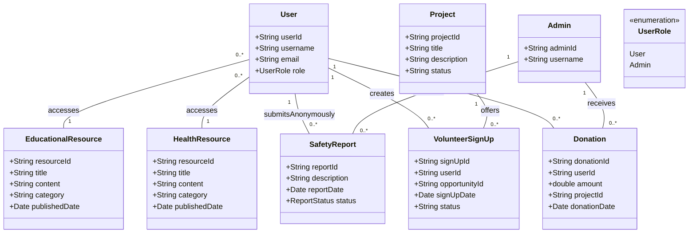

## Final Project: Web Design and User Experience Engineering

This project is made for Web Design and User Experience Engineering "Final Project Assignment" given by the Prof. Amuthan Arulraj.

"Developing a web application that includes both web UI and a backend server. This project demonstrates our expertise with the technologies that we learned in and outside the lectures. The project provide solutions to one of the global issues identified by UN <https://www.un.org/en/global-issues>".

## Author

- Vivek S Patil - <shankarpatil.v@northeastern.edu>
- Sanjay B R - <bangalorerenukapra.s@northeastern.edu>
- Yatish J - <jayaramareddy.y@northeastern.edu>
- Sathwik G S - <gowdarashanthakuma.s@northeastern.edu>

# Project Title: ChildGuard

ChildGuard is a comprehensive web application designed to enhance child welfare through educational resources, health and nutrition guides, and safety reporting mechanisms. This platform connects donors and volunteers to support various initiatives focused on improving the lives of children globally. Whether you're looking to contribute financially, volunteer your time, or access valuable resources, ChildGuard provides a seamless interface to make a positive impact.

## Solutions Offered

- **Educational Resources**: A library of free, accessible educational content tailored to different age groups and learning levels.
- **Health and Nutrition Guide**: Information and resources on child health and nutrition.
- **Safety Reporting Mechanism**: A anonymous platform for reporting child safety concerns.

## Technology Stack

- **Frontend**: React.js, Redux for state management.
- **Backend**: Node.js, MongoDB for data persistence.

## Features

- **User Management**: Secure registration, login, and profile management for donors and volunteers.
- **Educational Resources**: Access to a curated library of educational materials.
- **Health and Nutrition Guide**: Comprehensive guides and articles on child health and nutrition.
- **Safety Reporting Mechanism**: An anonymous platform for reporting child safety concerns.
- **Donation Platform**: A secure system for making financial contributions to our cause.
- **Volunteer Opportunities**: A portal for finding and signing up for volunteer work supporting child welfare initiatives.

# Object Model

