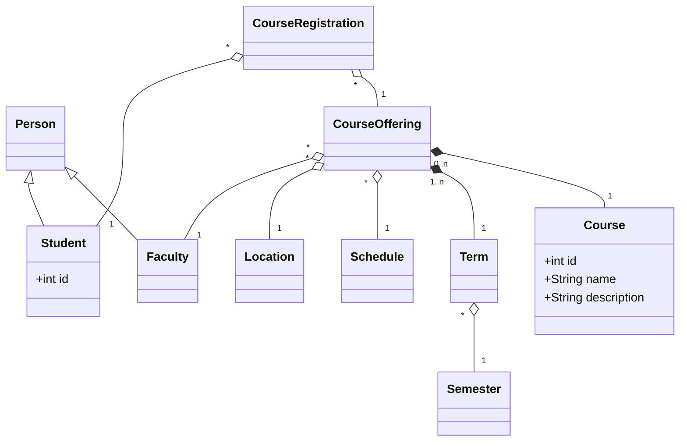

# Object Model

```mermaid

---
Object Model for course registration
---
classDiagram
    class Course {
        +int id
        +String name
        +String description
    }
    class Student {
        +int id
    }
    class Faculty
    class Person {

    }
    class Term
    class CourseOffering
    class CourseRegistration
    class Semester
    class Schedule
    class Location

    Person <|-- Faculty
    Person <|-- Student
    CourseOffering "0..n"*-- "1" Course
    CourseOffering "1..n" *-- "1" Term
    CourseOffering "*" o-- "1" Schedule
    CourseOffering "*" o-- "1" Location
    CourseOffering "*" o-- "1" Faculty
    Term "*" o-- "1" Semester
    CourseRegistration "*" o-- "1" CourseOffering
    CourseRegistration "*" o-- "1" Student
```
